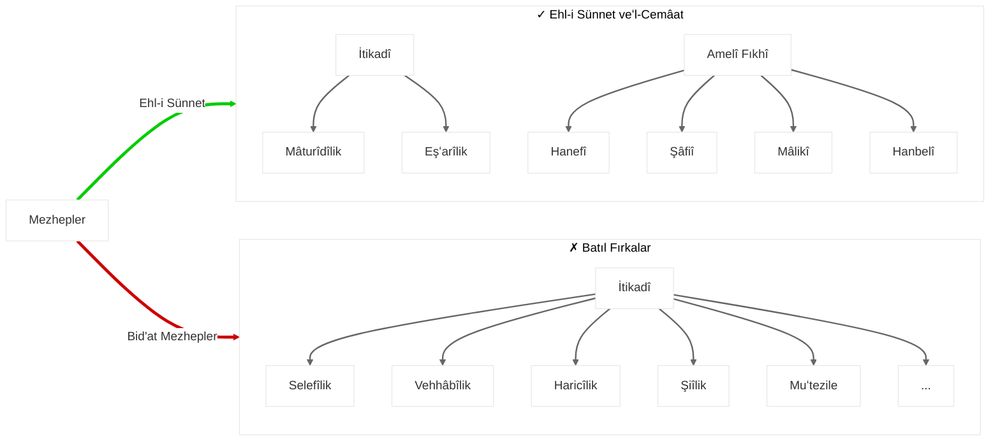

Bismillahirrahmanirrahim.

Atölye Kütüphanesine hoş geldiniz.. :)

## Site Rehberi:

> [!note] **Kısayollar**
>`CTRL + K`: Site içi arama
   `CTRL + G`: Graf görünümü

> [!info] **İşlevler**
> 1. Raflar'ın sağındaki klasör butonuna tıklayarak, sadece açık klasörün altındaki dosyaları listeleyebilirsiniz.
>2. Klasör isimlerinin üstüne tıklayarak, sadece tıklanan klasörü açar, diğerlerini kapatır ve tıklanılan klasörün içindeki listeleyen bir sayfaya yönlenirsiniz.
>3. Raflar yazısına tıklayarak, klasörleri kapatabilirsiniz. (Klasörlerin durumu sıfırlanacaktır.)
>4. Raflar'ın üstündeki güneş veya ay simgesine tıklayarak, karanlık ve aydınlık temalar arasında geçiş yapabilirsiniz.

> [!warning] **İletişim**
> Herhangi bir öneri ve şikayeti, `sifirib01+atolyekutuphanesi@gmail.com`'a iletebilirsiniz.

