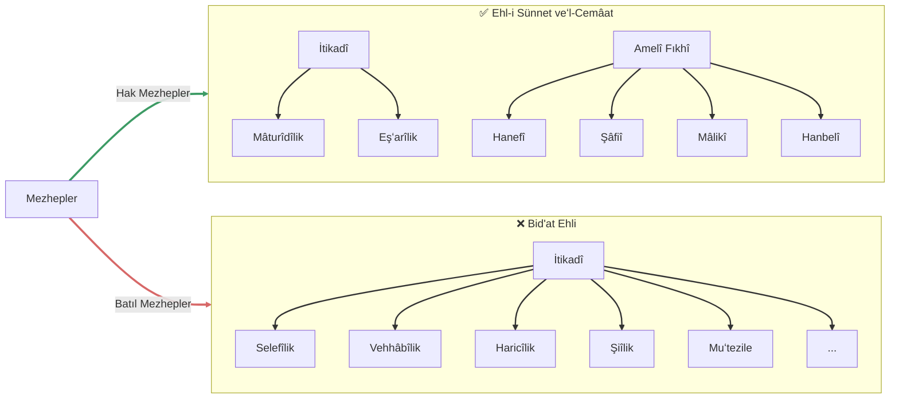

Bismillahirrahmanirrahim.

Atölye Kütüphanesine hoş geldiniz.. :)

```mermaid
graph LR
   A[Mezhepler]:::mezheplerRoot
   
   subgraph ES[✅ Ehl-i Sünnet veʻl-Cemâat]
       direction TB
       ES1[İtikadî]
       ES2[Amelî Fıkhî]
       
       ES1a[Mâturîdîlik]
       ES1b[Eşʻarîlik]
       
       ES2a[Hanefî]
       ES2b[Şâfiî] 
       ES2c[Mâlikî]
       ES2d[Hanbelî]
       
       ES1 --> ES1a
       ES1 --> ES1b
       ES2 --> ES2a
       ES2 --> ES2b
       ES2 --> ES2c
       ES2 --> ES2d
   end
   
   subgraph B[❌ Bid'at Ehli]
       direction TB
       B1[İtikadî]
       B1a[Selefîlik]
       B1b[Vehhâbîlik] 
       B1c[Haricîlik]
       B1d[Şiîlik]
       B1e[Muʻtezile]
       B1f[...]
       
       B1 --> B1a
       B1 --> B1b
       B1 --> B1c
       B1 --> B1d
       B1 --> B1e
       B1 --> B1f
   end

   A -->|Hak Mezhepler| ES
   A -->|Batıl Mezhepler| B
   
   
   linkStyle default stroke-width:2px
   linkStyle 12 stroke:#3d9b65,stroke-width:3px
   linkStyle 13 stroke:#d76868,stroke-width:3px
```

## Site Rehberi

> [!note] **Kısayollar**
> - `Ctrl + K`: Site içinde arama yapar.
> - `Ctrl + G`: Site Haritası'nı açar.
> - `Space`: Masaüstünde Raflar'daki bir dosya klavyeyle odaktayken önizlemesini açar.

> [!info] **İşlevler**
> 1. **Raflar:** Masaüstünde klasörler yan yana açılır; bir klasörü açmak okuduğunuz sayfayı değiştirmez. Büyüteçle dosya ve klasör adlarında arayabilir, sık kullandıklarınızı sabitleyebilirsiniz. Mobilde klasörler açılır liste olarak gösterilir.
> 2. **Kur'an-ı Kerim:** Sureleri sure sırasıyla veya alfabetik listeleyebilirsiniz. Raflarda surenin yanındaki `#` düğmesinden ya da sure sayfasındaki seçim alanından istediğiniz ayete gidebilirsiniz.
> 3. **Orijinal ve Meal:** Arapça metni ve meali ayrı ayrı veya birlikte okuyabilirsiniz. Ayetin yanındaki ok yalnızca o ayetin mealini açıp kapatır.
> 4. **Kopyalama:** Ayetin kopyalama düğmesi, meali sure adı ve ayet numarasıyla kopyalar. Diğer metinlerde seçim yapınca kopyalama seçenekleri çıkar; kalın ve italik yazılar destekleyen uygulamalarda korunur.
> 5. **Önizleme:** Masaüstünde bir dosya bağlantısının üzerinde kısa süre bekleyerek içeriğine bakabilirsiniz. Okuma pencerelerini taşıyabilir, boyutlandırabilir, kenara yaslayabilir, sabitleyebilir veya alt çubuğa küçültebilirsiniz.
> 6. **Ayarlar:** Yazı tipi, boyutu, okuma alanının genişliği ve renk paleti değiştirilebilir. Güneş/ay düğmesi açık ve koyu görünüm arasında geçiş yapar. Tercihleriniz tarayıcıda saklanır.
> 7. **Okuma alanı:** Masaüstünde sol paneli daraltabilir veya kitap düğmesiyle okuma modunu açabilirsiniz. Uzun sayfalardaki gezinme düğmeleriyle başa, sona ya da daha önce kaldığınız yere dönebilirsiniz.
> 8. **Günün ayeti:** Masaüstündeki üst çubukta ayetler akar. Akışı duraklatabilir veya çubuğu Ayarlar'dan kapatabilirsiniz.
> 9. **Sayfayı düzenle:** İçeriğin altındaki bağlantı ilgili dosyayı GitHub'da açar. Değişiklikleri kaydetme yetkisini GitHub kontrol eder.

> [!warning] **İletişim**
> Bir hata fark ederseniz veya öneriniz varsa [sifirib01+atolyekutuphanesi@gmail.com](mailto:sifirib01+atolyekutuphanesi@gmail.com) adresine yazabilirsiniz.

